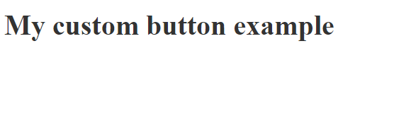
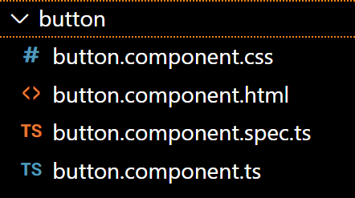

---

title: Create custom button in Angular
date: 03-12-2022
author: Sakshi Dheer
tags: Angular

---

So, why would one want to make a custom button or any other custom component? Because they are independent, reusable, and make your life a lot easier.

## Create a new project and get it ready(skip if you already know this)

Lets' start by creating a new project with Angular CI:

```bash
ng new custom-button-example
```
That's all you need to create a new project(you probably knew this already !!!!)

Next go to app.component.html and replace the content with the following code: 

```JS
<style>
  :host {
    color: #333;
  }

</style>
<div>
  <h1>My custom button example</h1>
</div>
```

Start the server with ng serve and you should be able to see the following page


## Create a button component

Next step would be to create the custom component by executing a simple command in Angular CLI

```bash
ng generate component button
```
This will generate following files in your app folder


## Add the component in app

#### Add styling


#### Add disability functionality

#### Add click functionality