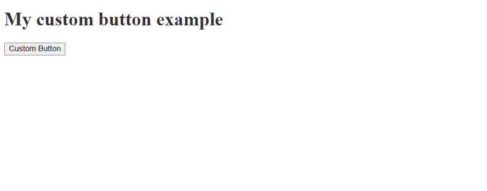

---

title: Create custom button in Angular
date: 03-12-2022
author: Sakshi Dheer
tags: Angular

---

So, why would one want to make a custom button or any other custom component? Because they are independent, reusable, and make your life a lot easier.

## Create a new project and get it ready(skip if you already know this)

Lets' start by creating a new project with Angular CI:

```bash
ng new custom-button-example
```
That's all you need to create a new project(you probably knew this already !!!!)

Next go to app.component.html and replace the content with the following code: 

```JS
<style>
  :host {
    color: #333;
  }

</style>
<div>
  <h1>My custom button example</h1>
</div>
```

Start the server with ng serve and you should be able to see the following page


## Create a button component

Next step would be to create the custom component by executing a simple command in Angular CLI

```bash
ng generate component button
```
This will generate following files in your app folder


Now, Let's add code to create a simple html button in button.component.html
```HTML
<button>{{label}}</button>
```
The "label" is the text that will appear on the button and we want it to be passed from the parent. So, lets prepare the child(button in our case to receive it) with @Input decorator.

```JS
import {
    Component,
    Input
} from '@angular/core';

...
export class ButtonComponent implements OnInit {

    @Input() label: string = ""; // This will receive label value from parent
    ngOnInit(): void {}

}
```

Now, Let's use this button in our app. Go to app.component.html and add the button with following code

```HTML
<app-button label="Custom Button"></app-button>
```

Now our main page will look as below:



## Add click functionality

Since we now have basic button let's add click functionality to our custom button.

Do the following in our ButtonComponent 

1. Import Output and EventEmitter
```JS
import  Output, EventEmitter  from '@angular/core';
```

2. Add a property called newItemEmitter and decorate it with @Output decorator
```JS
@Output() newItemEmitter = new EventEmitter();
```
The @Output decorator will allow us to pass data to parent component(app in our case).

## Add disability functionality

#### Add styling

